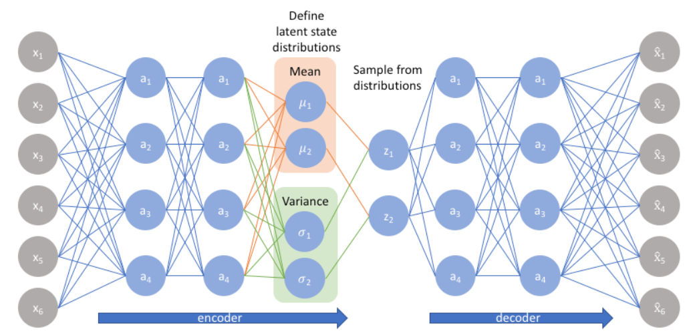

# Learning with Neural Networks

<aside>
💡

This is part 1 of the assignment. We will release part 2 in coming days and appropriate time will be given for same.

</aside>

# Introduction

This assignment involves solving a practical machine learning problem. We will gain experience with the iterative process of designing and validating a neural network architecture for a prediction problem using a popular deep learning library (PyTorch). A machine learning task involves making predictions from an input data source. In this assignment we will work with visual data in the form of images. Our focus will primarily be on thoroughly understanding the basic deep learning practices/techniques and a bit less on the modality (image) specific techniques (which can be explored in advanced courses). This assignment will provide few pointers on  designing good models. However, additional reading and experimentation from the student’s side will be helpful. *Please start the assignment early!*

# Problem Statement

We are given a data set consisting of images of different bird species with a total of K = 10  bird species present in the data set. Each species having between 500 and 1,200 images in the data set and each image containing a type single bird only. Please design a neural network that takes as input a bird image and predicts the class label (one of the K possible labels) corresponding to each image. The next section will provide some hints on designing and validating your model. 

# Model Design Guidelines

### Data Prepration

- To prepare the dataset for training, begin by splitting the images into **training** and **validation** sets. A common practice is to use an **80-20 split**, where 80% of the dataset is allocated for training and the remaining 20% is reserved for validation, simulating the model’s behaviour during test time. This is not a strict rule and 70-30 or 60-40 splits are also used.
- Create a **data loader** to handle loading the images for training and validation. The data loader will read the images, create batches, and apply any necessary preprocessing steps, such as resizing and normalization, to meet the input requirements of the model.  You can start by implementing the split using [scikit-learn’s `train_test_split`](https://scikit-learn.org/stable/modules/generated/sklearn.model_selection.train_test_split.html), and then proceed to build the data loader using [PyTorch's `DataLoader`](https://pytorch.org/tutorials/beginner/basics/data_tutorial.html), incorporating any preprocessing steps as needed.

### Network Layers

- A basic CNN architecture typically consists of a series of **convolutional layers** that extract features from the image, followed by **non-linearity** (usually ReLU activations) to introduce non-linear behaviour. Use of **pooling layers** introduces spatial invariance and should be explored. Such sequence of layers, help the network learn important features from images that can aid in the classification task.
- After the feature extraction, the output is passed through a **fully connected layer** (also known as a Multi-Layer Perceptron (MLP) denoted as `nn.Linear` in PyTorch.
- Finally, the network needs to predict the class label, using an activation such as *softmax*. Though the final layer may conceptually involve applying **softmax** to generate class probabilities, PyTorch's built-in loss functions, such as `CrossEntropyLoss`, automatically handle the *softmax* internally, so you don’t need to apply it explicitly in the model.
- Please keep track of the inputs and outputs resulting from these layers as they help in debugging. Experiments are required for designing the internal layers of your model.

### Loss Function

- Implement a loss function for multi-class classification. See the  **categorical cross-entropy**. In PyTorch, you can implement this using `nn.CrossEntropyLoss` for multi-class problems.
- Note that each class may have varied number of examples in the data set and some class fewer samples as compared to others. This is classed as class-imbalance and is commonly encountered in real world applications. To address this, you can give more weight to the underrepresented classes during training, penalizing the model more when it makes errors on these underrepresented classes. This can be done by assigning class weights inversely proportional to the number of samples per class, helping the model focus on minority classes and improve overall performance. You can refer this:  [link](https://pytorch.org/docs/stable/generated/torch.nn.CrossEntropyLoss.html)

### Optimisation

- The learning rate has a significant impact on model training. Please try scheduling the learning rate or performing grid search to find good values.
- In class we covered Stochastic Gradient Descent (SGD) for optimisation. Other techniques have also been developed that improve upon basic SGD. For example, a popular optimizer, **Adam** optimizer adjusts the learning rate based on parameter properties (and additionally uses momentum). We suggest starting out with Adam as the optimizer. Other optimizers may also be tried, however, Adam usually provides good results.
- Data Augmentation is process of generating new data samples from the existing dataset to improve model **generalizability**. You can try image rotation, horizontal flip, vertical flip to make model robust. Kindly restrict yourself to using PyTorch based transforms. You can refer PyTorch resources for the available data augmentation methods: [here](https://pytorch.org/vision/stable/transforms.html).

### Regularisation

- As the number of parameters in the model increases, the risk of overfitting also rises necessitating the use of regularising the model. Early stopping is one such technique where, one monitors the performance of the model on a validation set and halts training once the performance stops improving, preventing overfitting by not overtraining the model. Evaluate the impact of early stopping on your model.
- Other regularization techniques that you may try are:
    - **Dropout [2]**: Dropout randomly "drops" (sets to zero) a subset of neurons during training, forcing the network to learn more robust and generalized features.
    - **Batch Normalization** [[1](https://arxiv.org/abs/1502.03167)]: This technique normalizes the input to each layer in a neural network, helping to stabilize and speed up training. It also acts as a regularizer, reducing the need for other regularization techniques.

### Visualising Class Activation Maps

- To gain insights into which features the model is learning, we can apply **Grad-CAM (Gradient-weighted Class Activation Mapping)**. Grad-CAM helps visualize the important regions in an image that contribute to the model's decision for the predicted class by highlighting areas the model focuses on. Once the model is trained, apply Grad-CAM to see which regions of the image are most influential for each predicted class.
- One of the most popular implementation is : [https://github.com/jacobgil/pytorch-grad-cam](https://github.com/jacobgil/pytorch-grad-cam)

# Training and Evaluation process

**Training Code**

- [bird.py](http://part1.py) should contain the all the main code for train and testing the model.  We will run bird.py for training and testing in the following manner.
- Do  not change this format.
    
    ```python
    # Running code for training. save the model in the same directory with name "**bird.pth"**
    python bird.py path_to_dataset train bird.pth 
    
    # Running code for inference
    python bird.py path_to_dataset test bird.pth
    ```
    

**Model saving and loading:**

- After training, your code should save the model in the same directory with name **bird.pth.**
- There is no need to do hyper-parameter search during the final training. You need to submit the model with best hyper-parameters.
- You should follow the following method for loading and saving the model : [https://pytorch.org/tutorials/beginner/saving_loading_models.html](https://pytorch.org/tutorials/beginner/saving_loading_models.html)

```python
# save model
PATH = save_model_path
torch.save(model.state_dict(), PATH)

#Load model 
PATH =load_model_path
model = ModelClass()
model.load_state_dict(torch.load(PATH))
model.eval()
```

**Testing**

```python
# Running code for inference
python bird.py path_to_dataset test model_load_path
```

- **During testing, your code should produce a bird.csv file with  predicted label for each image.** You can use the following code to do the same. Keep column head as Predicted_Label.

```python
#ensure that shuffle is False
batch_size = 1
test_loader = DataLoader(test_dataset, batch_size=batch_size, shuffle=False)

def test_model(model, test_loader, criterion, device, output_csv='bird.csv'):
    model.eval()  
    total = 0
		results = []
    with torch.no_grad():  
        for images, _ in test_loader:
            images = images.to(device)
            
            # Forward pass
            outputs = model(images)
            # Get predictions
            # Save predicted labels
            results.extend(predicted.cpu().numpy())

    # Write only predicted labels to a CSV file
    with open(output_csv, 'w', newline='') as f:
        writer = csv.writer(f)
        writer.writerow(['Predicted_Label'])
        for label in results:
            writer.writerow([label])

```

- Ensure that you have put shuffle in DataLoader to false for during testing.
- We will evaluate the performance of the model on held-out test set consisting same number of classes but can have different distribution of image samples in each class.
- We will use average of ‘Macro’ and ‘Micro’ F1 score to evaluate the performance of your model. You can look here for reference [**Link**](https://scikit-learn.org/0.15/modules/generated/sklearn.metrics.f1_score.html)
    
    ```python
    from sklearn.metrics import f1_score
    y_true = [0, 1, 2, 0, 1, 2]
    y_pred = [0, 2, 1, 0, 0, 1]
    f1_macro = f1_score(y_true, y_pred, average='macro')  
    f1_micro = f1_score(y_true, y_pred, average='micro')  
    
    final = (f1_macro + f1_micro)/2
    ```
    

# Implementation Guidelines

- We encourage the use of **Convolutional Neural Networks (CNNs)** for this task. The use of **pre-trained features** from ResNet, AlexNet or Vision Transformers is **not** permitted (since our focus in on basic deep learning in this course). Similarly, direct import / use of existing implementation of common models such as ResNet, AlexNet etc. is **not** permitted.
- Training time : We expect the training time for your model to not exceed 2 hours.
- Model size: You should be able to get a good performance with 30 million parameters.  Feel free to try varying number of layers, but ensure that the model size should not exceed 80 million parameters.

```python
# Calculate the number of parameters
num_params = sum(p.numel() for p in model.parameters())
print(f"Total number of parameters: {num_params}")
```

- Set the seed  to following to ensure that your model gets the same performance of our system.

```python
import torch
torch.manual_seed(0)
```

- Your submission will include the trained network (Uploaded on your google drive and link shared with us) and the PyTorch implementation. Your model will be evaluated for accuracy on a test set using the network provided and the network that gets trained. The latter is for reproduce-ability, an increasingly important requirement in both industry and research.
- When submitting your work, please include a report (1-3 pages) that includes the following:
    - A diagram illustrating your model (or a table that specifies your architecture).
    - **Train and Validation Loss vs. Epochs**: Plot the training and validation loss over the epochs to demonstrate how the model's learning progresses over time.
    - **Train and Validation Accuracy vs. Epochs**: Plot the training and validation accuracy across epochs to show how well the model is performing on both the training and validation sets.
    - **Effect of Model optimisation** : Create a table detailing the **validation accuracy** for data augmentation, regularization technique used (e.g., L2 regularization, dropout), and discuss how these techniques impacted the model's performance.
    - **Class Activation Maps (CAM)**: For each class, provide visualizations of the **Class Activation Maps** and explain your observations. Discuss how the model interprets different regions of the image for each class and what insights you can draw from the highlighted areas.

# Starter Code

### Getting Started

Started code is available on the Moodle and have following structure:

```python
A3
|- enviroment.yaml #contains all the required libraries 
|- install.sh # install all the dependencies.
|- bird.py # Add all your code here.
|- run.ipynb # Contains instructions to run the code. 
|- Dataset # Download from kaggle 
```

> Check run.ipynb to setup the environment and dataset.
> 

## Development Environment

You can develop your solution either using your local setup or Kaggle. We recommend using Kaggle as it provide GPUs that can be helpful in model training. 

- Local setup: You can create a Python environment on your machine with `conda` using the command `conda env create -f environment.yml` . Here, `environment.yml` file is available with the starter code.
- You can setup kaggle following the instructions here:

Dataset link is provided in the document below. You can directly import the dataset to Kaggle using name [**Identify-the-Birds**](https://www.kaggle.com/datasets/aayushkt/identify-the-birds)

[instructionsA3.pdf](instructionsA3.pdf)

# Submission Guidelines

- **This assignment is to be done individually or in pairs. The choice is entirely yours.**
- **The assignment is intended for both COL333 and COL671 students.** If the assignment is being done in pairs then the partner is to be selected only within your class. That is COL333 students should be paired within COL333 and similarly masters students in COL671 should pair within their class of COL671.
- You should upload the your model in google drive and make use you make the file accessible to anyone with the link. Create a txt file with name model_path.txt and in first line put the link of your best model.  Ensure that there is not modification after the deadline.
- Please include the report (based on the description provided above). The first line of the report should list the name and entry number of student(s) who submit the assignment. Kindly restrict the report to 3 pages.  The report also carries some marks.
- The assignment is to be submitted on **Gradescope**. Exactly ONE of the team members needs to make the submission. All registered students have already been added to Gradescope. The details are given below.
    - You need to upload a single ZIP file named `"submission.zip"`. Upon unzipping, this zip should create a folder containing `bird.py`, `model_path.txt` , `group.txt` and report with name `2020CSZ1234_2020CSZ5678.pdf` . Do not rename the zip file.
    - The group.txt should include the entry numbers of all the group members (one per line). If you are working alone, simply include your own entry numbers. A sample `group.txt` is given below.
        
        ```
        2020CSZ1234
        2020CSZ5678
        ```
        
    - If you are working in pairs, you should select the partner using the “**Group Members**”  option after uploading the submission in Gradescope.
- **The submission deadline is 6 PM on Wednessday, November 6th , 2024.**
- This assignment (part I + part II) will carry $12$( $\pm3$)% of the grade.

## Other Instructions

- Late submission deduction of (10% per day) will be awarded. Late submissions will be accepted till 2 days after the submission deadline. There are no buffer days. Hence, please submit by the submission date.
- Please follow the assignment guidelines. Failure to do so would cause exclusion from assessment and award of a reduction (at least 10%). Please strictly **adhere** to the input/output syntax specified in the assignment as the submissions are processed using scripts. Failure to do so stall evaluations and takes away time from other course activities.
- Please do not modify files beyond the files you are supposed to modify. Failure to do so would cause exclusion from assessment/reduction.
- Queries (if any) should be raised on **Piazza**. Please keep track of Piazza posts. Any updates to the assignment statement will be discussed over Piazza.  Please do not use email or message on Teams for assignment queries.
- **Please only submit work from your own efforts.** Do not look at or refer to code written by anyone else. You may discuss the problem, however the code implementation must be original. Discussion will not be grounds to justify software plagiarism. Please do not copy existing assignment solutions from the internet or taken from past submission or submissions from other students; your submission will be compared against them using plagiarism detection software. Violations to the honour code will result in deductions as per course and institute policies.

## References

Primary reference are the lecture notes. The Russell and Norvig AIMA text book has related material in Chapter 18 (third edition) and Chapter 22 (fourth edition) respectively. 

[1]: Batch Normalization: Accelerating Deep Network Training by Reducing Internal Covariate Shift

[2]: Dropout: A Simple Way to Prevent Neural Networks from Overfitting.

[[3]: Grad-CAM: Visual Explanations from Deep Networks via Gradient-based Localization](https://arxiv.org/pdf/1610.02391)

PyTorch Tutorials:  [https://pytorch.org/tutorials/](https://pytorch.org/tutorials/)

PyTorch Tutorial slides presented by the TA in class: [pytorch_tutorial.pptx](https://csciitd-my.sharepoint.com/:p:/g/personal/csz218035_iitd_ac_in/Ee20knd0PwBBoLyf0PYr33oBAazdB-M4MFwbsr4rA6ExAw?e=vpDqZy)

Training an image classifier: [https://pytorch.org/tutorials/beginner/blitz/cifar10_tutorial.html](https://pytorch.org/tutorials/beginner/blitz/cifar10_tutorial.html)

Among deep learning specific text books, this text book (available [online](https://udlbook.github.io/udlbook/)) is a handy reference. Note that in this course we only cover an overview of deep learning. 

 
****


# Assignment 3 (Part II): Representation Learning

# Introduction

This assignment focuses on learning useful representations from *unlabelled* data for downstream tasks. You’ll work with image data that has no labels, aiming to extract meaningful representations and use them to categorise images into one of N categories.

The assignment considers the task of learning a representation of given data using a Variational Autoencoder (VAE), an extension to the standard auto-encoder. We we explore how the representation learnt via a VAE can be used to generate new data samples by modifying the learnt latent vector, and using the structured latent representations (a smaller embedding) for categorising data. Overall, the student will also get exposure to unsupervised learning in this assignment. Please start the assignment early providing time to read and perform experiments!

# Problem Description

- The previous part of the assignment, which involves training a classifier using supervised learning, required a dataset of thousands of labelled image pairs. However, humans can often extract essential features just from unlabelled images, allowing them to classify them easily when provided with very few examples.  This part of the assignment addresses a similar goal: learning structured latent representations from unlabelled images of “digits” to enable classification with minimal examples. Specifically, you will learn a compact latent representation from unlabelled images and then use these to build a model that categorises images of digits into one of three groups (1, 4, or 8) with just 2-3 examples!
- Formally, this part of the assignment has two components. First, you will train a Variational Autoencoder (VAE) to extract useful features from the images. Then, you will use the learnt features for a downstream task like classification in a low-data regime. In particular, you will implement a Gaussian Mixture Model (GMM) to cluster the extracted latent representations. Once the clusters are learned, you can categorise any unseen images by first extracting their features through the trained encoder and assigning a cluster label based on the maximum likelihood.

# Implementation Details

## Component I: Training Variational Autoencoder

### VAE Basics

- In the lectures, we covered Autoencoders, which use an encoder to map data points (e.g., an image) to a latent vector and a decoder to reconstruct the data (another image) from that vector. However, it is difficult to sample from Autoencoders to generate data. Let us say that we randomly set the latent code to a value and try to generate data. This approach typically does not work well since it is very easy for random values to become out of distribution to the data the network has observed during training.  In essence, their lack of structure in the latent space, limits their ability to generate new good quality data.
- Variational Autoencoders (VAEs) address this issue by constraining the latent space by imposing a normal distribution on the latent space. Once a VAE has been trained, new data can be generated by sampling the values of the latent vector (from a Gaussian) which is then passed through the decoder to generated new data (images in our case). The VAE architecture has been found to be effective in learning good representation as well as sampling new data.
- In a VAE, the encoder (a neural network) learns to output a mean and variance (the distribution of the latent space) for each data point provided as input. These outputs parameterise a Gaussian distribution from which the latent vector is assumed to be sampled. This enables smooth interpolation and new sample generation. VAE training is in an auto-encoder style where the network tries to encode the input and then decode the output with the loss attempting to minimise the reconstruction loss. However, the VAE loss includes two terms: (i) a **reconstruction loss term** (e.g., MSE or binary cross-entropy), which ensures the output image closely resembles the input, and (ii) the **KL divergence term**, which regularises the latent distribution toward a standard normal distribution. The total loss is a sum of these two terms, with a weighting factor $\beta$ controlling the balance between them. Let $\hat{I}$ be the reconstructed image, $I$ be the original image and $(\mu, \sigma)$ are the mean and variance vectors produced by the encoder, then the loss function is

$$
Loss(I, \hat{I}) = MSE(I, \hat{I}) + \frac{1}{2} \sum \left( 1 + \log(\sigma^2) - \mu^2 - \sigma^2 \right)
$$

- The interested student can refer to [this article](https://www.jeremyjordan.me/variational-autoencoders/) to understand the basics of VAEs for the assignment. Please see the reference section for a detailed list of blogs/articles which could help you in learning the math behind VAEs. Finally, the loss function has a simple form so understanding all the mathematical details is not a pre-requisite to get going. But obtaining an overview of the formal details makes the model construction very clear.

### Architecture

A VAE is realized by implementing and encoder and a decoder network (see figure below).



We recommend MLP-based Encoder-Decoder architecture. For the encoder, use a MLP to learn the spatial features and map the $28 \times 28$ image to the latent dimension of size 2.  By `latent dimension=2`, we mean that the encoder output a 2-dimensional gaussian distribution i.e., mean $\mu \in \mathbb{R}^2$ and the diagonal covariance matrix $\begin{pmatrix} \sigma_1 & 0 \\ 0 & \sigma_2\end{pmatrix}$. For decoder, can use a MLP that maps the sampled 2-dim vector into a $28\times 28$ vector.

### Loss function

Loss function is a combination of reconstruction loss and KL divergence between latent vector and unit normal N(0, 1).  For reconstruction loss, you can use MSE loss or binary cross entropy.

```python
# Here recon_x is reconstructed image and x is input image 
def loss_function(recon_x, x, mu, logvar):
    BCE = nn.functional.binary_cross_entropy(recon_x.view(-1, 784), x.view(-1, 784), reduction='sum')
    KLD = -0.5 * torch.sum(1 + logvar - mu.pow(2) - logvar.exp())
    return BCE + KLD
```

### Evaluating the Image reconstruction

The reconstruction ability of your implementation will be evaluated. For images in the validation dataset, plot the reconstructed image from VAE and **add in the report**.

For consistency, use the following code to visualize the reconstructed images.

```python
def show_reconstruction(model, val_loader, n=10):
    model.eval()
    data, labels = next(iter(val_loader))
  
    data = data.to(device)
    recon_data, _, _ = model(data)
  
    fig, axes = plt.subplots(2, n, figsize=(15, 4))
    for i in range(n):
        # Original images
        axes[0, i].imshow(data[i].cpu().numpy().squeeze(), cmap='gray')
        axes[0, i].axis('off')
        # Reconstructed images
        axes[1, i].imshow(recon_data[i].cpu().view(28, 28).detach().numpy(), cmap='gray')
        axes[1, i].axis('off')
    plt.show()

show_reconstruction(vae, val_loader)
```

### Generating new images

Note that the latent space of the VAE is normal distribution that allows us to sample latent vectors and pass it to the decoder to generate new images from the data distribution. In this part of the assignment, we will evaluate the VAE's generation capability by uniformly sampling from the latent space. Specifically, use the following code snippet to sample latent vectors, feed them into the VAE’s decoder, and generate new images. **Include these generated images in your report** to show your VAE's generative performance.

You can use the following code to generated images and plot in form of grid..

```python
import numpy as np
import torch
import matplotlib.pyplot as plt
from scipy.stats import norm

def plot_2d_manifold(vae, latent_dim=2, n=20, digit_size=28, device='cuda'):
    figure = np.zeros((digit_size * n, digit_size * n))

    # Generate a grid of values between 0.05 and 0.95 percentiles of a normal distribution
    grid_x = norm.ppf(np.linspace(0.05, 0.95, n))
    grid_y = norm.ppf(np.linspace(0.05, 0.95, n))

    vae.eval()  # Set VAE to evaluation mode
    with torch.no_grad():
        for i, yi in enumerate(grid_x):
            for j, xi in enumerate(grid_y):
                z_sample = torch.tensor([[xi, yi]], device=device).float()
              
                # Pass z to VAE Decoder 
                # Write your code here

                figure[i * digit_size: (i + 1) * digit_size,
                       j * digit_size: (j + 1) * digit_size] = digit

    plt.figure(figsize=(10, 10))
    plt.imshow(figure, cmap='gnuplot2')
    plt.axis('off')
    plt.show()

plot_2d_manifold(vae, latent_dim=2, n=20, digit_size=28, device='cuda')
```

### Visualization of  Latent Space

To visualize the structure of the VAE's latent space, extract the latent vector for each image in the training dataset, then plot these vectors in a 2D scatter plot. Add this **scatter plot to your report** and observe the distribution. Look for distinct clustering patterns—ideally, you should see three clusters, each resembling a 2D normal distribution. Comment on whether the clusters are well-separated and follow the expected distribution, indicating the VAE has effectively organized the latent space for classification.

## **Component II: Classification using learnt embedding features**

Since the VAE has now learned to extract useful embedding features from the images, we can use its latent vectors to develop a classifier using only a few labelled samples. Here, you will first extract the mean of the latent distribution for each image in the training dataset, then apply a Gaussian Mixture Model (GMM) to cluster these vectors into three distinct groups, each representing a different digit class.

To initialise the cluster means for the GMM, use the validation dataset as follows: for each digit class in the validation set, calculate the mean of the latent vectors for images in that class. This class-specific mean will serve as the initial cluster centres in your GMM. Please implement the GMM from scratch in Python, without reliance on any library/package implementations. Use the validation dataset to tune hyperparameters for optimal performance, and submit the model that performs best based on your validation results.

Once the GMM is trained, you can classify any new image by passing it through the VAE encoder to obtain its latent vector, then assigning it to the cluster with the highest likelihood.

### Visualising the GMM model

To visualise the GMM model, plot each Gaussian distribution as an ellipse, with the center representing the mean and the shape reflecting the covariance. This visualisation will help assess whether the learned GMM effectively separates the clusters. Analyze the plot to determine if the clusters are distinct or if there is overlap that could indicate misclassification.

### Evaluation of the learnt GMM

```python
def evaluate_gmm_performance(labels_true, labels_pred):
  
    accuracy = accuracy_score(labels_true, labels_pred)
    precision_macro = precision_score(labels_true, labels_pred, average='macro')  # Macro precision
    recall_macro = recall_score(labels_true, labels_pred, average='macro')  # Macro recall
    f1_macro = f1_score(labels_true, labels_pred, average='macro')  # Macro F1

    # Return metrics as a dictionary
    return {
        'accuracy': accuracy,
        'precision_macro': precision_macro,
        'recall_macro': recall_macro,
        'f1_macro': f1_macro
    }

# Example usage:
metrics = evaluate_gmm_performance(labels_val, gmm_pred_val)
```

# Training and Evaluation process

## Dataset

The MNIST dataset comprises images of digits ranging from 0 to 9. For this assignment, we will focus on the images of the digits 1, 4, and 8. You will be provided with an unlabelled training dataset for training the Variational Autoencoder (VAE) in Part I, along with a small labelled validation dataset that can be utilised to determine cluster centres and optimise the hyperparameters during the classification step. During the testing phase, your model should accurately predict the class for each image in the test dataset. It is essential to note that no labels should be employed during the training of the VAE. Each image in the dataset has dimensions of 28x28 pixels. The dataset is supplied as NumPy arrays, and you will need to create a custom dataset class to facilitate the loading of the data.

## **Training Code**

- The file `vae.py` should contain the all the main code for train and testing the model.  We will run `vae.py` for training and testing in the following manner.

```python
# Running code for training. save the model in the same directory with name "vae.path**"
# Save the GMM parameters in the same folder. You can use pickle to save the parameters.** 
python vae.py path_to_train_dataset path_to_val_dataset train vae.pth gmm_params.pkl

# Running code for vae reconstruction.
# This should save the reconstruced images in numpy format. see below for more details.
python vae.py path_to_test_dataset_recon test_reconstruction vae.pth

#Running code for class prediction during testing
python vae.py path_to_test_dataset test_classifier vae.pth gmm_params.pkl
```

- Ensure that your code strictly adheres to the submission format, as deviations may incur penalties.
- The validation dataset will only consist of few samples 5 per each class. You can use these samples to initialize cluster and map cluster to class.
- You will have a maximum of 2 hours to train the VAE model, so please ensure that your code includes appropriately optimized hyper-parameters.

  ### **Model saving and loading:**


  - After training, your code should save the model in the same directory with name `vae.**pth`.**
  - You code should not be doing hyper-parameter search in training during evaluation in our servers. You need to submit the model with best hyper-parameters.
  - You should follow the following method for loading and saving the model : [https://pytorch.org/tutorials/beginner/saving_loading_models.html](https://pytorch.org/tutorials/beginner/saving_loading_models.html)

  ```python
  # save model
  PATH = save_model_path
  torch.save(model.state_dict(), PATH)

  #Load model 
  PATH =load_model_path
  model = ModelClass()
  model.load_state_dict(torch.load(PATH))
  model.eval()
  ```

## Evaluation

Evaluation will be based on the VAE’s performance in reconstructing given images and the combined VAE+GMM model’s accuracy in classifying unseen images in the test dataset.

### **Reconstruction**

To evaluate your VAE’s reconstruction performance, you’ll be provided with a test set of 10 images in a NumPy array format of shape [$10 \times 28 \times 28$]. Your task is to generate reconstructed versions of these images using your VAE and save the reconstructed images in a NumPy array of the same shape, named `vae_reconstructed.npz`.

```python
# Running code for image reconstruction
python vae.py path_to_test_dataset_recon test_reconstruction vae.pth
```

We will evaluate the reconstructed images with a combination of (1 - Mean square error) between predicted and ground truth images and `structural similarity score (SSIM)`. Ensure that you image output  range is between 0-1.  You can read more about SSIM here: [Link](https://scikit-image.org/docs/stable/api/skimage.metrics.html#skimage.metrics.structural_similarity)

### Downstream task: Classification

Next, we will evaluate the model’s classification performance on held-out test set consisting same number of classes. A test dataset containing images will be provided, and the model should classify each image, storing the predicted labels in `vae.csv`. Please label the column header as `Predicted_Label`. Ensure that shuffling is set to False in the DataLoader during testing.

```python
# Running code for classification
python vae.py path_to_dataset test_classifier model_load_path gmm_params_path
```

We will use average of ‘Macro’ and ‘Micro’ F1 score to evaluate the performance of your model.

# Other Guidelines

- **Architecture:** We encourage the use of Multilayer perceptron (MLP) as encoder and decoder in VAE. You are free to use CNN based architectures as well. However, you should be able to get a decent performance using MLP.  The use of **pre-trained features** from ResNet, AlexNet or Vision Transformers is **not** permitted (since our focus in on basic deep learning in this course) and will not be useful. Similarly, direct import / use of existing implementation of common models such as ResNet, AlexNet etc. is **not** permitted.
- **Training time :** We expect the training time for your model to not exceed 1 hours.
- **Model size:** You should be able to get a good performance with 10 million parameters.  Feel free to try varying number of layers, but ensure that the model size should not exceed 20 million parameters.

```python
# Calculate the number of parameters
num_params = sum(p.numel() for p in model.parameters())
print(f"Total number of parameters: {num_params}")
```

- Set the seed  to following to ensure that your model gets the same performance of our system.

```python
import torch
torch.manual_seed(0)
```

- Your submission should include the trained network model. Please upload it to Google Drive and provide a shareable link in your `model_path.txt` file. This step supports reproducibility, which is an increasingly essential requirement in both industry and research.
- Use of  `sklearn` is only allowed for calculating metrics. Don’t do any additional imports of `sklearn` than what is already provided in the starter code.

# Starter Code

### Getting Started

Started code is available on the Moodle and have following structure:

```python
A3
|- enviroment.yaml #contains all the required libraries 
|- install.sh # install all the dependencies.
|- vae.py # Add all your code here.
|- run.ipynb # Contains instructions to run the code. 
|- Dataset # Download from kaggle or using the drive link
```

> Check run.ipynb to setup the environment and dataset.

- The development environment, local or kaggle setup is similar to that of Part I.
- Dataset link is provided  [Here](https://drive.google.com/drive/folders/1CLxNjtoLfV9e678kXr_21wiD_yoxpkDZ?usp=sharing)

# Submission Guidelines

- You should upload the your model in google drive and make use you make the file accessible to anyone with the link. Create a txt file with name model_path.txt and in first line put the link of your best model.  Ensure that there is not modification after the deadline.
- Please include the report (based on the description provided above). The first line of the report should list the name and entry number of student(s) who submit the assignment. Kindly restrict the report to 3 pages.  The report also carries some marks.
- The assignment is to be submitted on **Gradescope**. Exactly ONE of the team members needs to make the submission. All registered students have already been added to Gradescope. The details are given below.
  - You need to upload a single ZIP file named `"submission.zip"`. Upon unzipping, this zip should create a folder containing `vae.py`, `model_path.txt` , `group.txt` and report with name `2020CSZ1234_2020CSZ5678.pdf` . Do not rename the zip file.
  - The group.txt should include the entry numbers of all the group members (one per line). If you are working alone, simply include your own entry numbers. A sample `group.txt` is given below.

    ```
    2020CSZ1234
    2020CSZ5678
    ```
  - If you are working in pairs, you should select the partner using the “**Group Members**”  option after uploading the submission in Gradescope.
- **The submission is due on 6 PM on Monday, November 11th , 2024. The assignment can be submitted after the due date for up to three days (till the last teaching day) for a 5%, 10% and 15% adjustment to the score.**

## Other Instructions

- ~~Late submission deduction of (10% per day) will be awarded. Late submissions will be accepted till 2 days after the submission deadline.~~ The assignment can be submitted till 14th November for a 5%, 10% and 15% adjustment.
- Hence, please submit by the submission date.
- Please follow the assignment guidelines. Failure to do so would cause exclusion from assessment and award of a reduction (at least 10%). Please strictly **adhere** to the input/output syntax specified in the assignment as the submissions are processed using scripts. Failure to do so stall evaluations and takes away time from other course activities.
- Please do not modify files beyond the files you are supposed to modify. Failure to do so would cause exclusion from assessment/reduction.
- Queries (if any) should be raised on **Piazza**. Please keep track of Piazza posts. Any updates to the assignment statement will be discussed over Piazza.  Please do not use email or message on Teams for assignment queries.
- **Please only submit work from your own efforts.** Do not look at or refer to code written by anyone else. You may discuss the problem, however the code implementation must be original. Discussion will not be grounds to justify software plagiarism. Please do not copy existing assignment solutions from the internet or taken from past submission or submissions from other students; your submission will be compared against them using plagiarism detection software. Violations to the honour code will result in deductions as per course and institute policies.

# References

- Implementation of VAE using neural network: [https://www.jeremyjordan.me/variational-autoencoders/](https://www.jeremyjordan.me/variational-autoencoders/)
- Intuitive understanding of VAE: [https://towardsdatascience.com/intuitively-understanding-variational-autoencoders-1bfe67eb5daf](https://towardsdatascience.com/intuitively-understanding-variational-autoencoders-1bfe67eb5daf)
- Original VAE paper (more mathematical; you can skip this if you want): [https://arxiv.org/abs/1312.6114](https://arxiv.org/abs/1312.6114)
